# 💜 Shizuru - NixOS Configuration

<p align="center">
  
  <h1 align="center">Shizuru</h1>
  <p align="center">Aesthetic, Modular NixOS Configuration</p>
  
</p>

<div align="center">

[](https://github.com/maotsugiri/Shizuru/stargazers)
[](https://github.com/maotsugiri/Shizuru)
[](https://nixos.org)
[](LICENSE)

</div>

---

## 🌟 Preview

### Hyprland Screenshots
> Quickshell config inspired by [caelestia-dots/shell](https://github.com/caelestia-dots/shell)

<div align="center">
  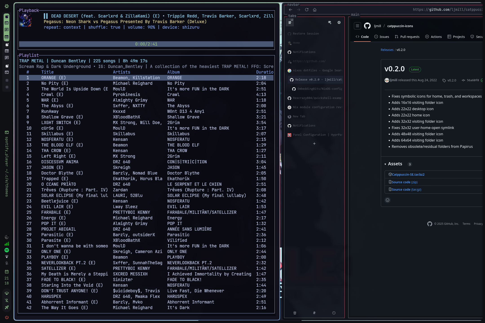
  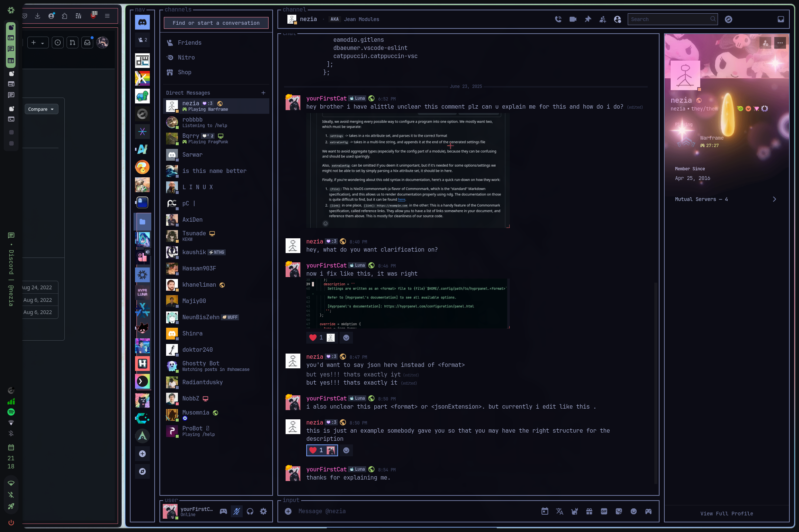
  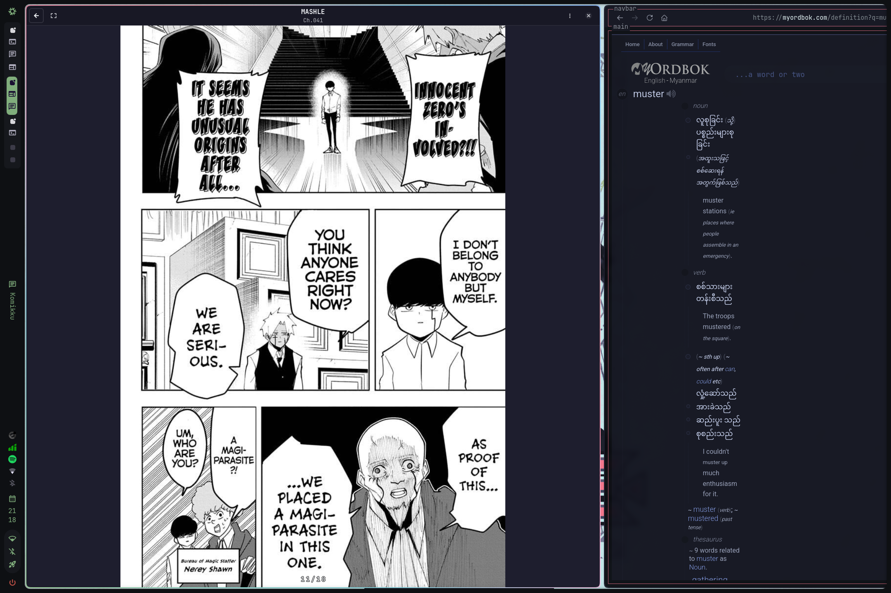
  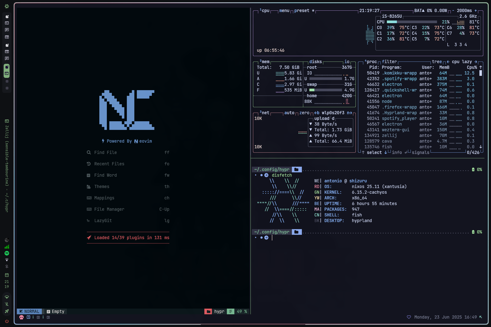
  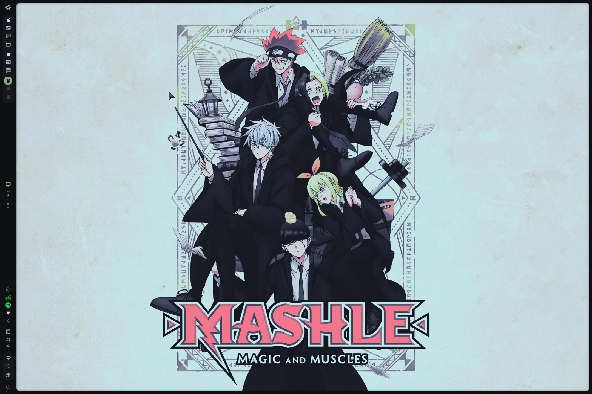
  
</div>
<p align="center"><em>Screenshots last updated: 2025-04-29</em></p>

### Niri Screenshots
<div align="center">
  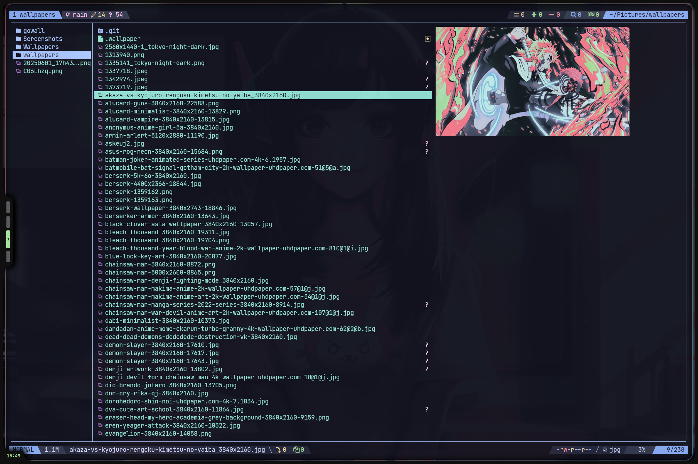
  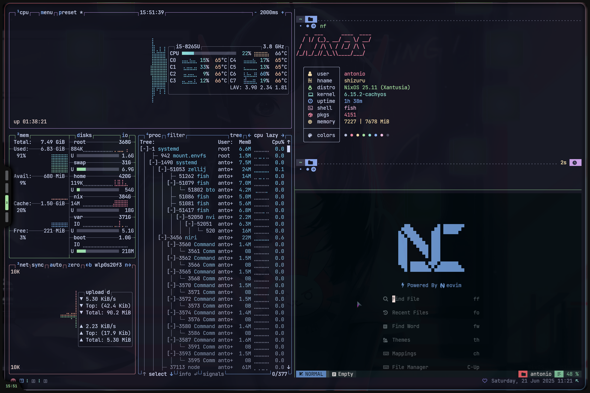
  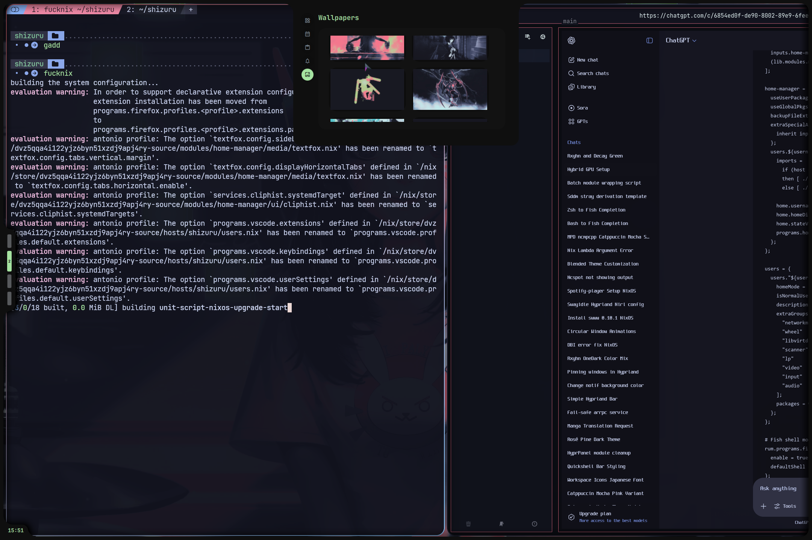
  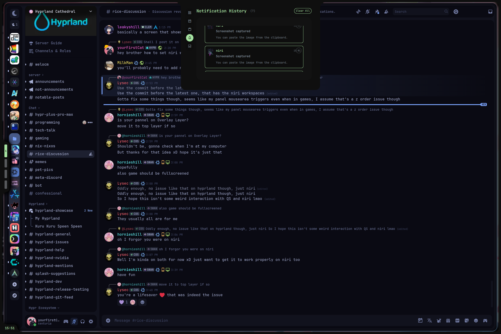
  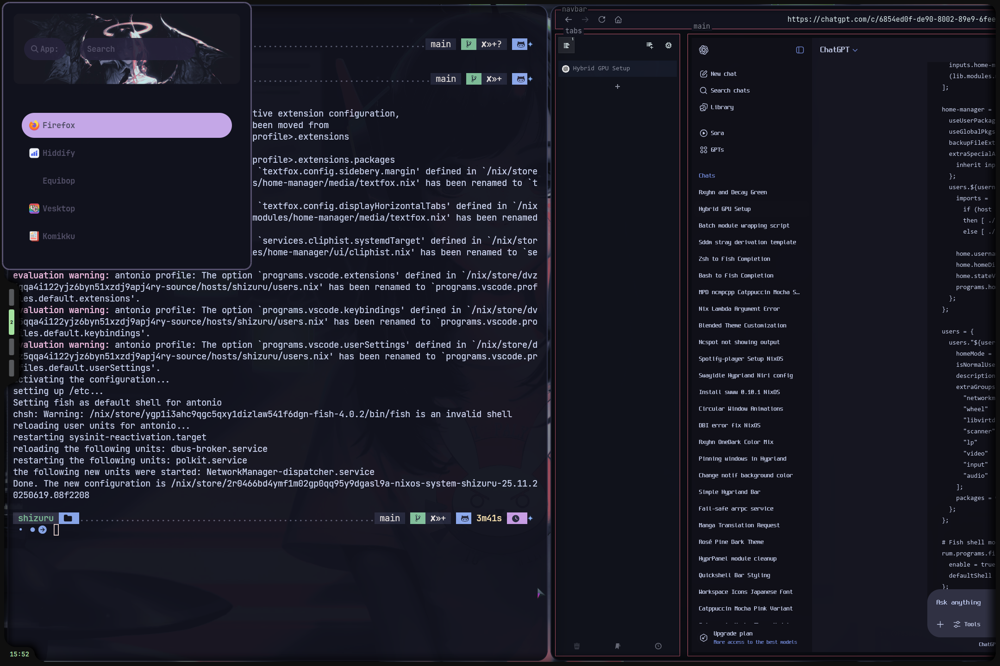
  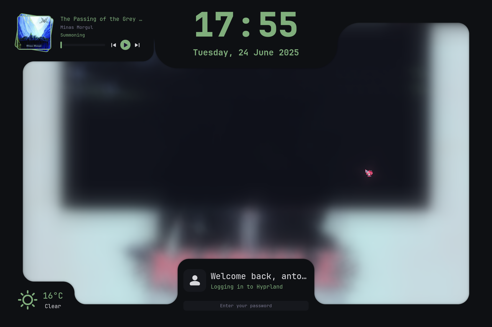
</div>
<p align="center"><em>Screenshots last updated: 2025-06-23</em></p>

---

## ✨ Features

### Core
- ❄️ **Flakes** – Declarative and reproducible system
- 🏡 **hjem + hjem-rum** – Modular home config system
- 💽 **home-manager** – Legacy support during transition

### Desktop Environment
- 🏠 **Niri** – Primary Wayland compositor
- ⚠️ **Hyprland** – Secondary Wayland compositor
- 📊 **QuickShell** – System panel and desktop UI

### Applications
- 🚀 **Walker** – Application launcher
- 📝 **VSCodium & NvChad** – Code editors
- 🐟 **Fish + Starship** – Shell environment
- 🖥️ **WezTerm + Kitty** – Terminal emulators

---

## 🗂️ Project Structure

```text
.
├── flake.nix            # Main flake configuration
├── hosts/               # Per-host configurations
│   ├── default/        # Default desktop configuration
│   └── shizuru/        # Shizuru host configuration
│       ├── config.nix  # Kernel, packages, SCX
│       ├── hardware.nix # Hardware profile
│       ├── user.nix    # Shell & user packages
│       ├── variables.nix # Git info, env vars
│       ├── hjem.nix    # hjem module
│       ├── home.nix    # home-manager overlay
│       └── theme.nix   # Theming config
└── modules/            # Reusable Nix modules
    ├── system/        # System-wide modules
    │   ├── common/    # Bootloader, Plymouth
    │   ├── desktop/   # Display and WM configs
    │   ├── options/   # Desktop/laptop options
    │   └── share/     # Shared modules
    └── home-manager/ # Home-manager modules
        ├── ags/      # AGS configurations
        ├── hana/     # Hana configurations
        ├── fabric/   # Fabric configurations
        ├── media/   # Media configurations
        ├── niri/    # Niri configurations
        ├── ui/      # UI configurations
        ├── zellij/  # Zellij configurations
        └── editors/ # Editor configurations
```
--- 

## 🛠️ Components

| Category            | Components                                                                 |
|---------------------|----------------------------------------------------------------------------|
| **Window Manager**  | [Niri](https://github.com/YaLTeR/niri), [Hyprland](https://hyprland.org)   |
| **Shell**          | Fish + [Atuin](https://github.com/ellie/atuin) + [Starship](https://starship.rs) |
| **Terminal**       | WezTerm, Kitty                                                            |
| **Editor**         | [VSCodium](https://vscodium.com), [NvChad](https://nvchad.com) via [nix4nvchad](https://github.com/nix-community/nix4nvchad) |
| **UI Components**  | [AGS](https://github.com/Aylur/ags), [HyprPanel](https://github.com/hyprwm/hyprpanel), QuickShell |
| **Utilities**      | [yazi](https://github.com/sxyazi/yazi), [grimblast](https://github.com/hyprwm/contrib), [wl-clip-persist](https://github.com/brunelli/wl-clip-persist) |
| **System**         | [CachyOS kernel](https://github.com/CachyOS/linux-cachyos), NetworkManager |

---

## � Theming

- **Color Scheme**: Catppuccin Mocha & Dark
- **Fonts**: JetBrains Mono, LigaMono Nerd Font
- **Icons**: [Papirus-Dark](https://github.com/PapirusDevelopmentTeam/papirus-icon-theme)
- **Cursor**: Chiharu

---

## 🙏 Acknowledgments

This configuration draws inspiration from many amazing NixOS users:

- [Frost-Phoenix/nixos-config](https://github.com/Frost-Phoenix/nixos-config)
- [nomadics9/NixOS-Flake](https://github.com/nomadics9/NixOS-Flake)
- [samiulbasirfahim/Flakes](https://github.com/samiulbasirfahim/Flakes)
- [justinlime/dotfiles](https://github.com/justinlime/dotfiles)
- [fufexan/dotfiles](https://github.com/fufexan/dotfiles)
- [hjem](https://github.com/feel-co/hjem) & [hjem-rum](https://github.com/snugnug/hjem-rum) for home config

Special thanks to the NixOS community for their incredible work!

---

<p align="center">
  
</p>

<div align="center">
  <a href="#-shizuru---nixos-configuration">↑ Back to Top ↑</a>
</div>
